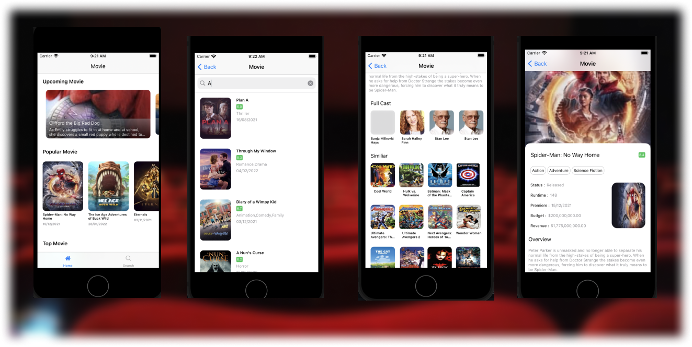

# CinemaSwiftUI

Sample project built with SwiftUI and use MVVM pattern, this application implements api from [themoviedb](http://themoviedb.org).

<p></p>

#### Requirement
```
- iOS 11.0+
- Xcode 12.5
```

## Getting Started
add api key themoviedb to `core/data/constant`, attribute `apiKey`

to run this project

```
  sudo gem install cocoapods

  Pod install

```


#### Libraries

* [Alamofire](https://cocoapods.org/pods/Alamofire)
* [Kingfisher](https://cocoapods.org/pods/kingfisher)
* [AlertToast](https://cocoapods.org/pods/AlertToast)
* [SwiftGen](https://github.com/SwiftGen/SwiftGen)